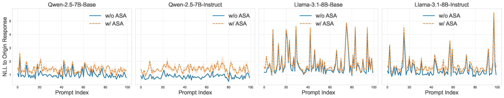
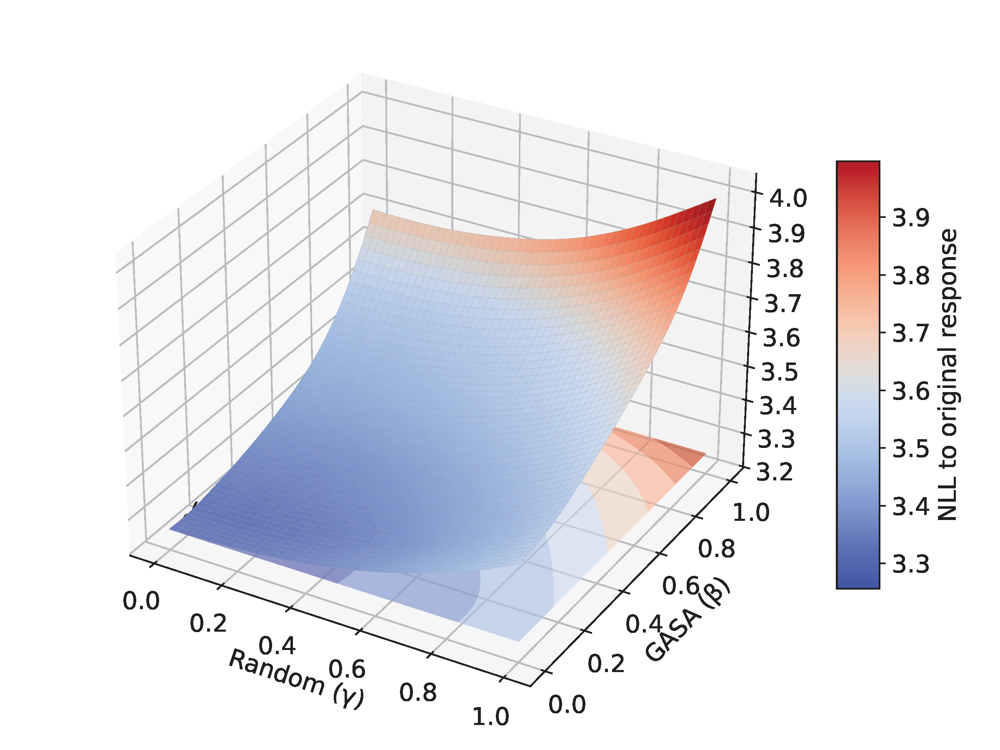

# LatentSafety


This is the official implementation of the paper "Probing the Safety Robustness of LLMs in Latent Space".


## Install the Environment

To set up the environment, run the following commands:

```bash
git clone {Url to Repo}
cd LatentSafety
pip install -r requirements.txt
```
This will install all necessary dependencies listed in the `requirements.txt`.


## ASA Attack

To run the ASA attack, use the following command:

```bash
python -m exp.effectiveness \\
	--model_name_or_path DeepSeek-R1-Distill-Qwen-1.5B \\
	--seed 42 \\
	--jailbreak 'random' \\ You can also choose gasa or "trojan" 
	--dataset 'advbench' \\ You can also choose 'gcg'
	--max_new_tokens 50 \\
	--num_samples 100
```

The output will be saved in a JSON file named `{args.seed}_{args.jailbreak}_{args.max_new_tokens}_{model_name}_{args.num_samples}.json`,
with results written incrementally during execution (typically takes less than 2 hours per model).

- Setting `--jailbreak gasa` enables the gradient-based variant $\mathrm{ASA_{grad}}$ as described in the paper.
- Setting `--jailbreak trojan` constructs perturbations based on difference between activation means of positive and negative samples.

## Annotation

You can run the following command to annotate the ASA result files:

```bash
python -m exp.annotate --input_file {args.seed}_{args.jailbreak}_{args.max_new_tokens}_{model_name}_{args.num_samples}.json \\
                       --output_file  {args.seed}_{args.jailbreak}_{args.max_new_tokens}_{model_name}_{args.num_samples}_annotated.json \\
                       --targt steered_response 
```

Then, use the command below to aggregate the annoteted resulst and compute the MASR and PASR metrics for the corresponding model:

```bash
python -m exp.aggregate
```

The results will be saved to `summary.json`, here is an example:

```json
{
    "model": "42_random_20_Qwen2.5-7B_100_0_100_annotated.json",
    "total_prompts": 100,
    "successful_prompts": 85,
    "MASR": 0.85,
    "PASR": 0.63
},
```

## ASABench


```bash
python -m exp.asa \\
		  --model_name_or_path {model path to be evaluated} \\
          --model_name {model_name} \\
          --save_path {path to save the results} \\
          --mode {Please set mode to 'lapt'}
```

## Layer-wise Adversarial Patch Training

```bash
python -m train
```

## Key Library Introduction

Here we provide some of the visualization code used in the paper, which may serve as helpful tools for interpretability research.

### NLL Curve for ASA and $\mathrm{ASA_{grad}}$



```bash
python -m sv.loss
```

### Landscape for ASA and $\mathrm{ASA_{grad}}$



```bash
python -m exp.landscape
```

